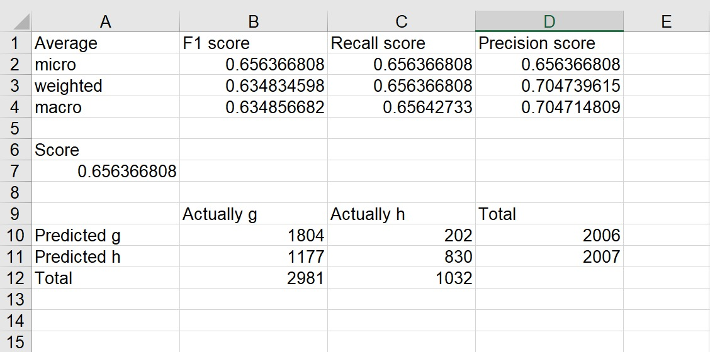
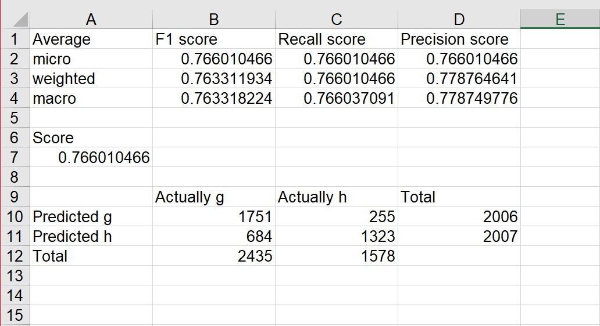
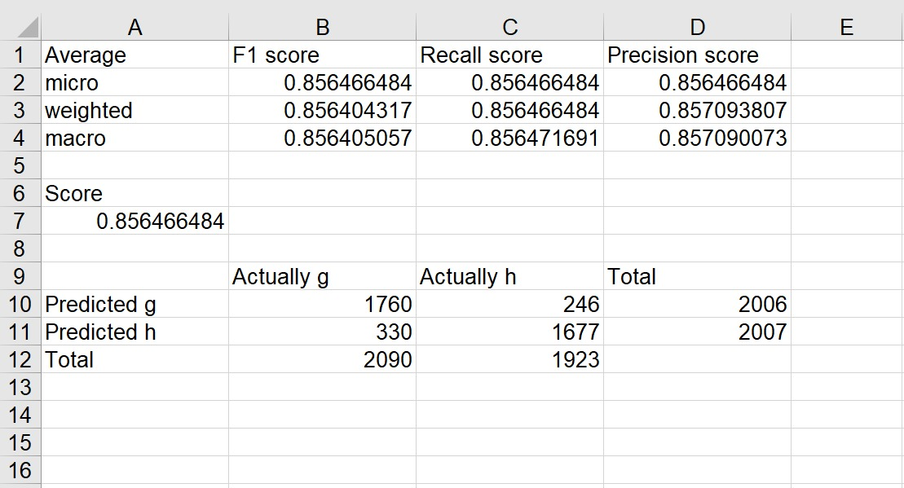
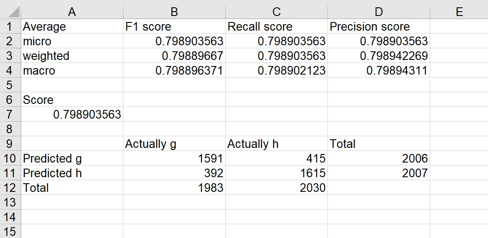
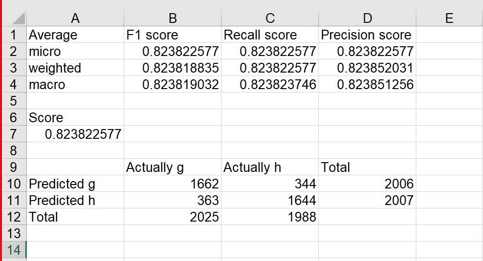

# Data Classification

Classification of data set using python (scikit-learn library)

## Dataset

To find out more about the dataset: https://archive.ics.uci.edu/ml/datasets/MAGIC%2BGamma%2BTelescope

Data set name

```
magic04.data
```

## Algorithms Used

1. Naive-Bayes
2. K-Nearest Neighbour
3. Random-Forest
4. Decision-Tree
5. Ada-Boost

## How To Run The Progam

1. Run main.py

## Output

Ouptut of the run is generated in

```
/output/
```

It contains:

1. Tuning graph for K-Nearest Neighbour, Random-Forest, Ada-Boost algorithms.
2. Excel file containing model accuracy, precision, recall and F- measure as well as the resultant confusion matrix
   using the testing data.

### Sample Output

#### K-Nearest Neighbour Tuning Graph


#### Random-Forest Tuning Graph


#### Ada-Boost Tuning Graph


#### Naive-Bayes Data



#### K-Nearest Neighbour Data



#### Random-Forest Data



#### Decision-Tree Data



#### Ada-Boost Data


 
